# PigMap
猪猪地图能让您方便地创建不同的地点清单，在地图上标记清单中的地点，帮助您更轻松地规划旅游线路；也可以将清单分享给好友，共同享受愉快的旅途

ps. 此项目是使用uni-app开发的微信小程序，使用uniCloud云函数和云数据库存储账号数据

## 小程序截图
创建清单

  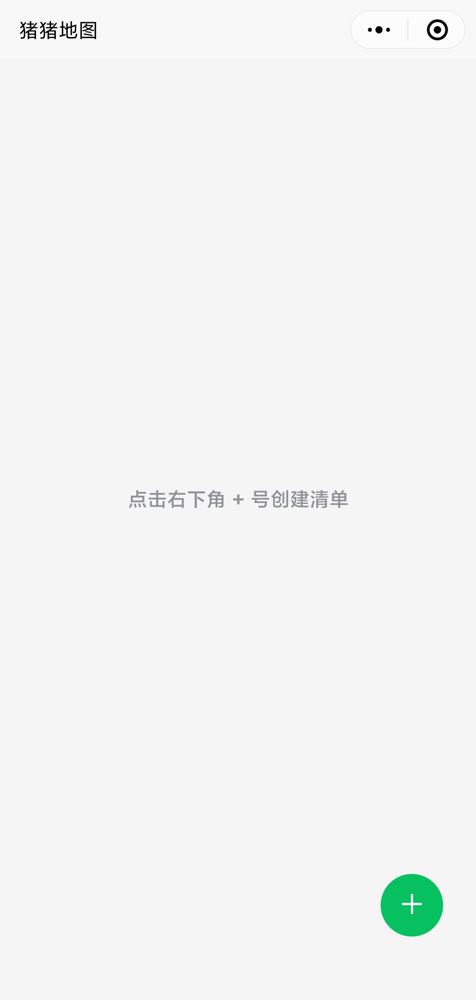
  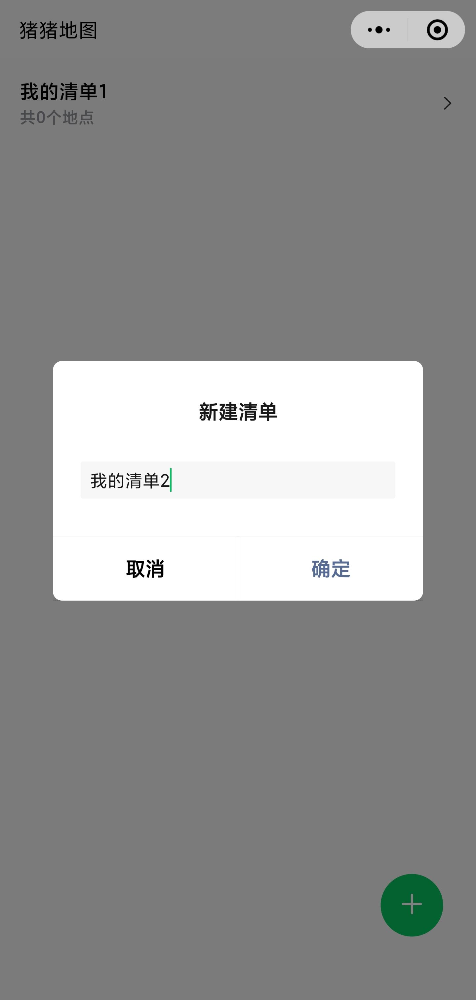

 
 

长按进入编辑模式，再次长按或点击右下角按钮退出编辑模式

  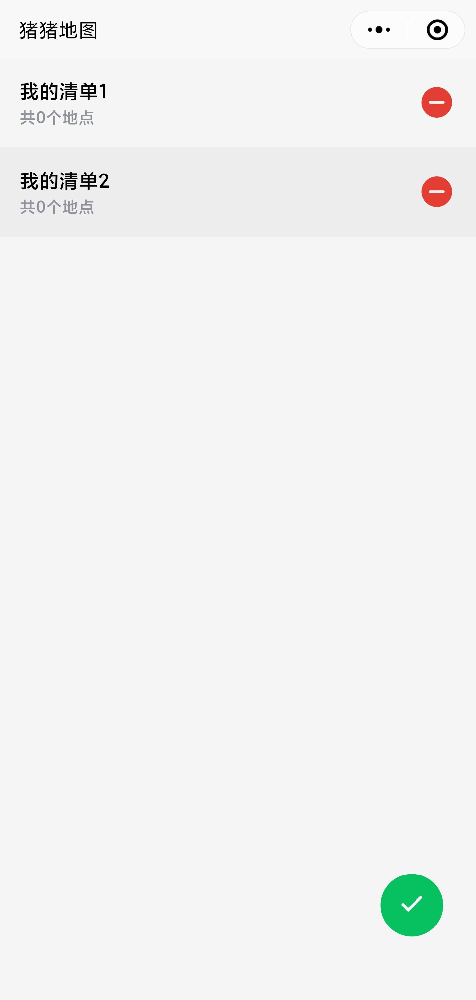

 
 

修改清单名称、删除清单

  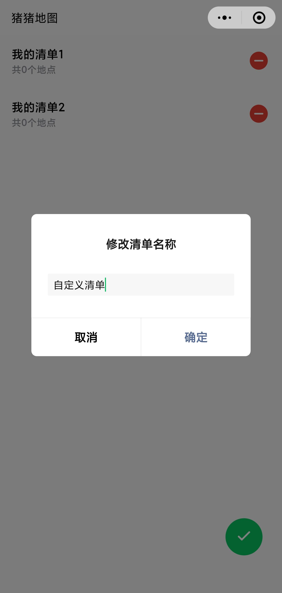
  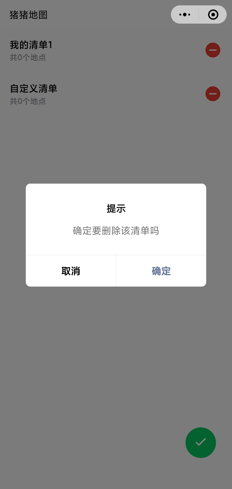

 
 

进入清单，添加地点，查看详细地址

  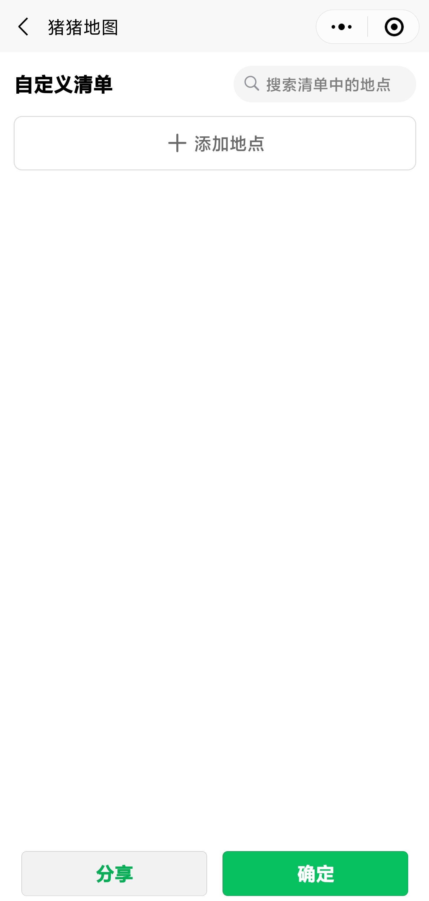
  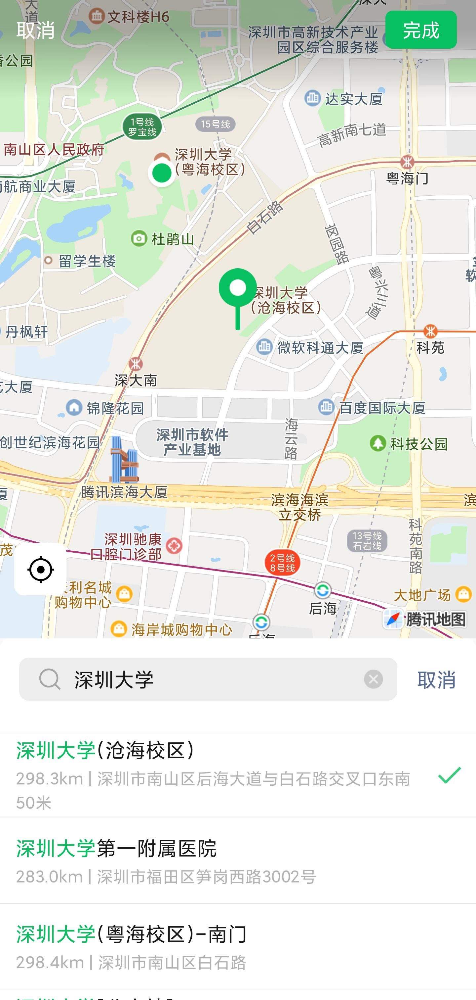
  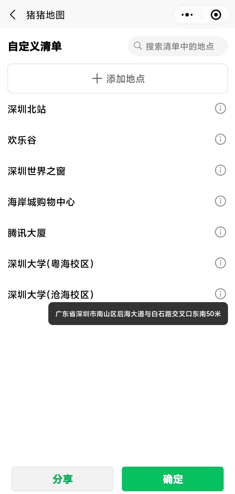

 
 

长按多选删除地点

  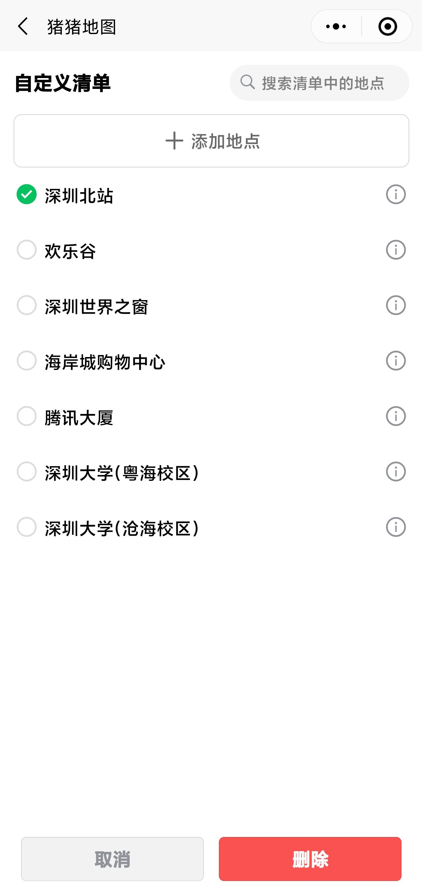
  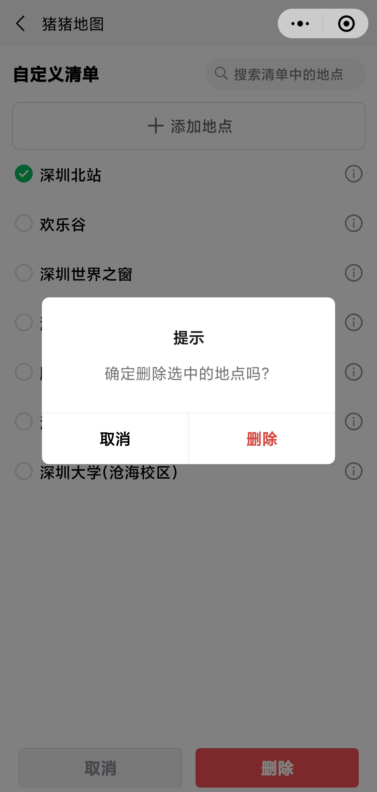

 
 

搜索清单中的地点

  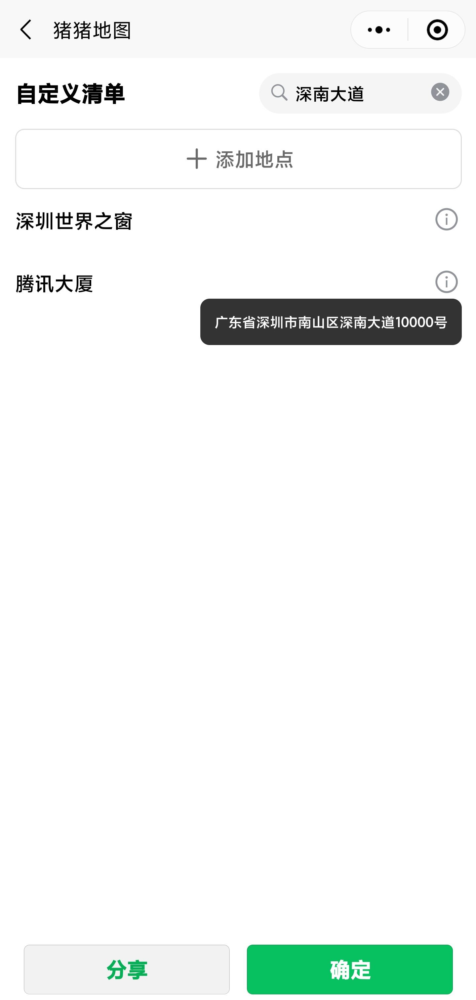

 
 

打开地图，查看标记的地点（点击左下角地图按钮可以缩小地图至覆盖所有地点）

  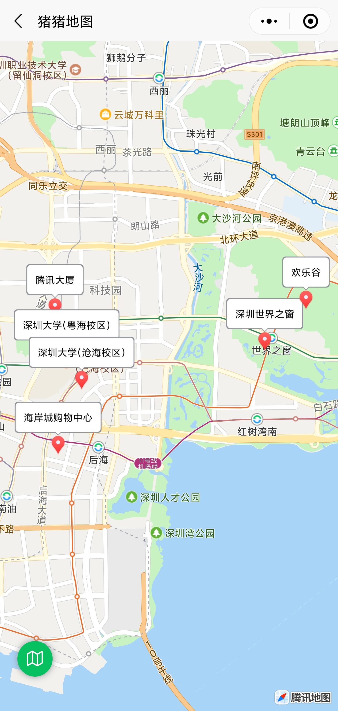

 
 

点击某个地点，查看地点详细信息（点击右侧的定位按钮可以将该地点放大居中）

  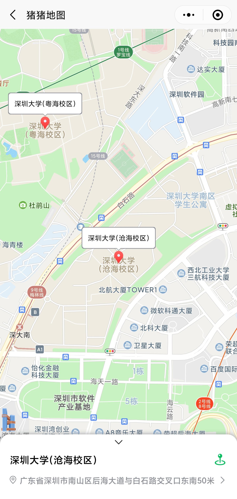

 
 

点击详细地址进入导航页

  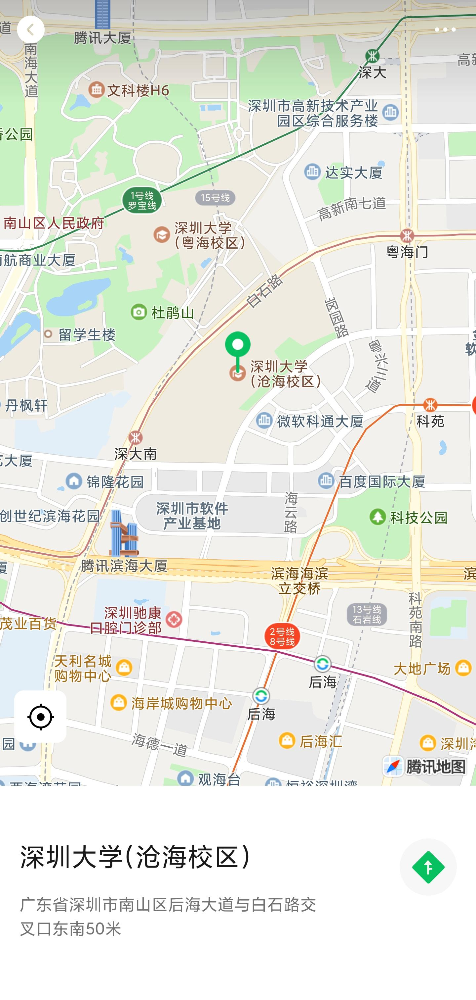
  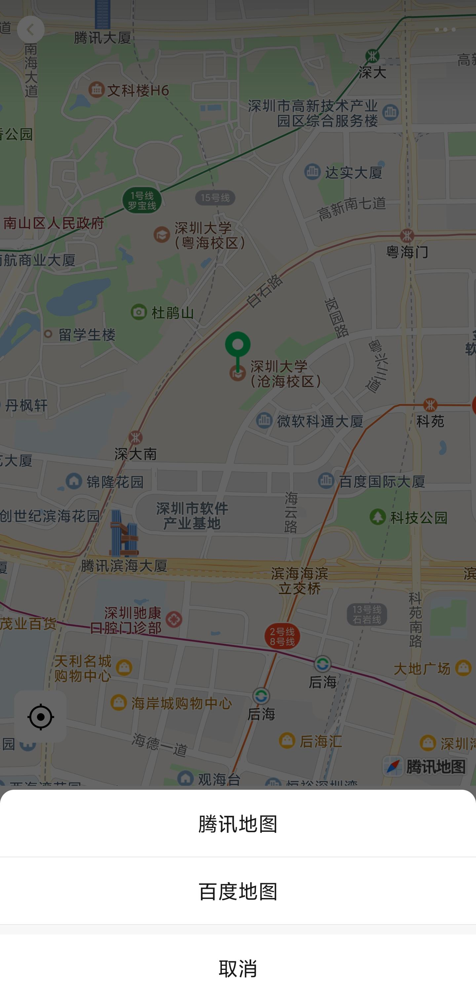

 
 

在右上角选择分享或点击清单页的分享按钮，分享清单

  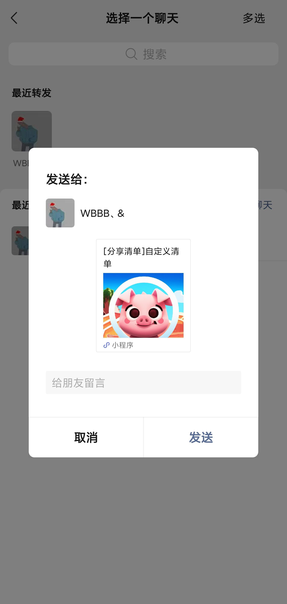

 
 

查看、保存他人分享的清单

  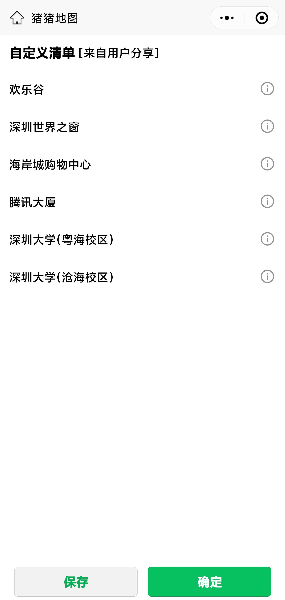
  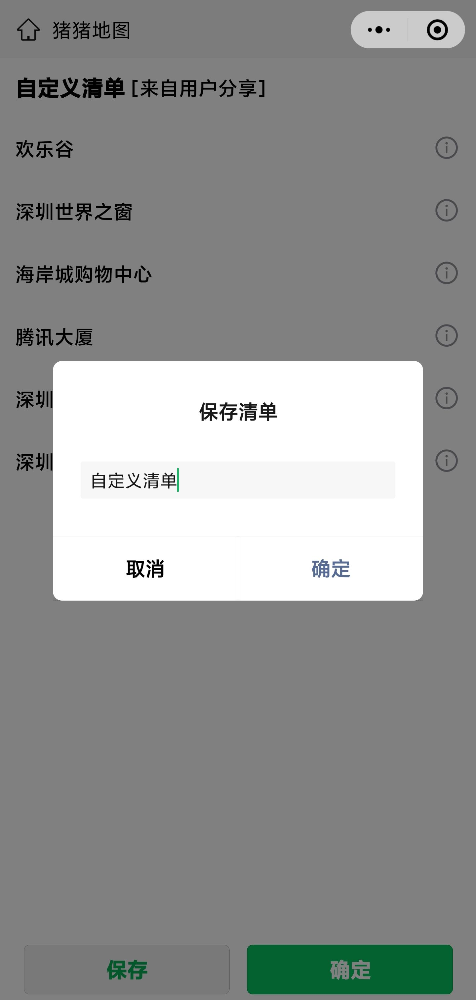
  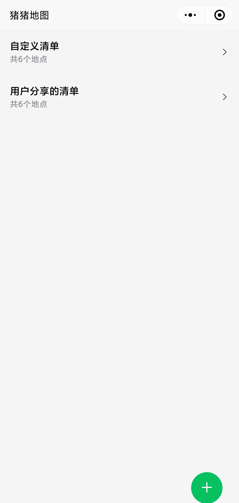

 
 

## 开发

1. 安装依赖：`pnpm install`
2. 复制 `.env.example` 为 `.env.local`，填入 uniCloud 服务空间的 SpaceId 和 ClientSecret
3. 运行 `pnpm dev:mp-weixin`，用微信开发者工具打开 `dist/dev/mp-weixin`

云函数和数据库 Schema 用 HBuilderX 上传。`login` 云函数需要在 uniCloud 控制台配置环境变量 `WX_APPID`、`WX_APPSECRET`

## 发版

1. 在 `CHANGELOG.md` 写好这一版的更新说明并提交
2. 运行 `pnpm release`，选择版本号
3. GitHub Actions 自动构建并上传到微信，之后在微信公众平台提交审核、发布

需要在 GitHub 配置的 Secrets：`MP_UPLOAD_KEY`（小程序代码上传密钥）、`UNICLOUD_SPACE_ID`、`UNICLOUD_CLIENT_SECRET`
